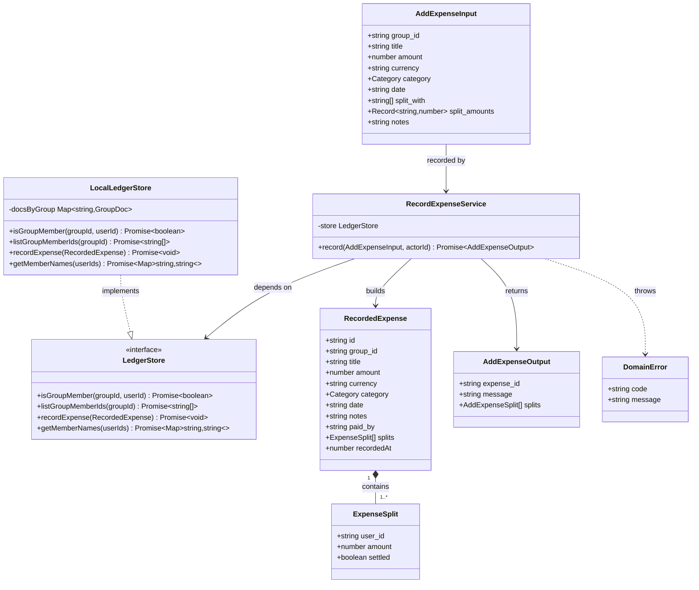

# Record an Expense on a Local-First Persistence Port

> **Scope note.** This canvas covers the **recording** slice only: introduce a technology-neutral persistence port, re-home the existing `add_expense` handler onto it behind a domain recording service, and ship a minimal local (in-memory/file) adapter so recording works offline today. The CRDT engine and sync transport remain **deferred** behind the port. The other five tools (`get_expenses`, `get_balances`, `settle_up`, `get_groups`, `attach_receipt`) stay on the current Supabase path until migrated in follow-up slices — do **not** refactor them here. Receipt storage is out of scope (separate follow-on step).

## Requirements

- Enable a user to **record an expense** they paid for a group and split it among real group members, working **fully offline**.
- Decouple recording from any specific database so the storage/sync technology can be **swapped as late and as cheaply as possible** — the domain depends on an interface, never on a vendor client.
- Guarantee the recorded ledger is **trustworthy**: a recorded expense is written atomically, its splits always reconcile to the total, and only group members can be recorded or split against — enforced in the application, since there is no database-level row security in a local-first store.
- Preserve the existing **single-schema, dual-adapter** contract (one Zod schema consumed by both the MCP and OpenAPI adapters) with no change to tool inputs/outputs.

## Entities

## Approach

1. **Persistence abstraction (the core move)**:
   - Introduce a `LedgerStore` port — a technology-neutral, **aggregate-oriented** interface (no query builders, no SQL, no transactions leaking through). It exposes exactly what recording needs: membership checks, member id/name lookup, and an atomic `recordExpense`.
   - The composition roots (`mcp/adapter.ts`, `openapi/routes.ts`) build a `LedgerStore` via a factory instead of handing a `SupabaseClient` to the recording handler. Swapping backends later = one new adapter + one factory switch; the service and adapters are untouched.
   - Design decision & rationale: an aggregate-oriented port is the only shape a future CRDT adapter can satisfy without a rewrite — a SQL-shaped port would defeat the entire deferral goal.

2. **Local-first data model**:
   - The **group is the sync/replication document**. `recordExpense` appends **one immutable expense event** (expense + all its splits) into that group's document as a single atomic change — a partially-recorded expense can never exist, even after a future merge.
   - Balances are **derived on read** (existing `get_expenses`/`get_balances` behavior), never stored as mutable counters — this is what makes concurrent offline recording merge-safe.
   - Technology choice: ship a `LocalLedgerStore` backed by an in-process map with optional local-file persistence (engine-agnostic). Automerge/Yjs plug in later behind the same interface — explicitly deferred.

3. **Business logic & validation (moved into the domain)**:
   - `RecordExpenseService.record()` runs, in order: actor-is-member check → resolve participant set (payer ∪ `split_with`, de-duplicated) → all-participants-are-members check → split allocation (custom or deterministic equal split with remainder-cent handling) → split-sum reconciliation → build the immutable `RecordedExpense` → single atomic `store.recordExpense()` → map to `AddExpenseOutput`.
   - Authorization replaces RLS: every check is explicit and unit-tested.
   - Error handling strategy: the service throws typed `DomainError`s (with a stable `code`); each transport adapter maps `DomainError` to its own error shape — OpenAPI to an HTTP status + JSON body, MCP to an `isError` text result. This replaces today's "everything is a generic `Error` → 500."

## Structure

### Inheritance / implementation relationships
1. `LedgerStore` interface defines the persistence contract required to record an expense.
2. `LocalLedgerStore` implements `LedgerStore` (in-memory + optional local file), engine-agnostic and offline.
3. `DomainError` extends `Error` and carries a machine-readable `code` (e.g. `NOT_A_MEMBER`, `SPLIT_MISMATCH`, `INVALID_GROUP`).
4. Future `CrdtLedgerStore` / `SupabaseLedgerStore` will also implement `LedgerStore` (out of scope here; the port must not assume either).

### Dependencies
1. `RecordExpenseService` depends on `LedgerStore` (constructor-injected) — nothing else.
2. `handlers.addExpense` delegates to `RecordExpenseService` (thin wrapper preserving the existing exported signature shape, but taking a `LedgerStore` instead of a `SupabaseClient`).
3. `mcp/adapter.ts` and `openapi/routes.ts` obtain a `LedgerStore` from a `createLedgerStore()` factory (composition root) and pass it into the recording handler.
4. `createLedgerStore()` selects the adapter from env/config; today it returns `LocalLedgerStore`.

### Layered architecture
1. **Transport/adapter layer** (`mcp/adapter.ts`, `openapi/routes.ts`): auth, Zod validation, call handler, map `DomainError` → transport error. Unchanged for the 5 non-recording tools.
2. **Handler layer** (`tools/handlers.ts` → `addExpense`): thin delegation to the domain service.
3. **Domain/service layer** (new `domain/recordExpense.ts`): all business rules, validation, allocation, reconciliation, authorization.
4. **Persistence port** (new `ports/ledgerStore.ts`): the `LedgerStore` interface + `RecordedExpense`/`ExpenseSplit` domain shapes.
5. **Adapter layer** (new `adapters/localLedgerStore.ts` + `adapters/factory.ts`): the local-first implementation and the factory.

## Operations

### Create Port — `packages/api/src/ports/ledgerStore.ts`
1. Responsibility: define the technology-neutral persistence contract for recording, plus the domain aggregate shapes.
2. Types:
   - `ExpenseSplit`: `{ user_id: string; amount: number; settled: boolean }`
   - `RecordedExpense`: `{ id: string; group_id: string; title: string; amount: number; currency: string; category: string; date: string; notes?: string; paid_by: string; recordedAt: number; splits: ExpenseSplit[] }`
3. Interface `LedgerStore`:
   - `isGroupMember(groupId: string, userId: string): Promise<boolean>`
   - `listGroupMemberIds(groupId: string): Promise<string[]>`
   - `recordExpense(expense: RecordedExpense): Promise<void>` — MUST persist the expense and all its splits as one atomic unit (all-or-nothing).
   - `getMemberNames(userIds: string[]): Promise<Map<string, string>>`
4. Constraints: no method exposes SQL, query builders, or transaction handles; all inputs/outputs are plain domain values so any adapter (local, CRDT, cloud) can satisfy it.

### Create Domain Error — `packages/api/src/domain/errors.ts`
1. Inheritance: `class DomainError extends Error`.
2. Attributes: `code: string` (stable, screaming-snake), `message: string` (human-readable, no sensitive internals).
3. Constructor: `constructor(code: string, message: string)` → sets `this.code`, `this.name = "DomainError"`.
4. Exported codes (as a const map): `INVALID_GROUP`, `NOT_A_MEMBER`, `SPLIT_TARGET_NOT_MEMBER`, `SPLIT_MISMATCH`, `INVALID_AMOUNT`, `DUPLICATE_PARTICIPANT`.
5. Usage: thrown by `RecordExpenseService`; mapped to transport errors by the adapters.

### Create Service — `packages/api/src/domain/recordExpense.ts`
1. Interface: `class RecordExpenseService { constructor(store: LedgerStore) }`.
2. Core method: `record(input: AddExpenseInput, actorId: string): Promise<AddExpenseOutput>`
   - Input Validation:
     - Assert `await store.isGroupMember(input.group_id, actorId)`; else throw `DomainError(NOT_A_MEMBER, …)`.
     - Build `participants = unique([actorId, ...input.split_with])`; if any id appears in `split_with` more than once (raw), throw `DUPLICATE_PARTICIPANT`.
     - Fetch `memberIds = await store.listGroupMemberIds(input.group_id)`; if empty throw `INVALID_GROUP`; assert every participant ∈ memberIds, else `SPLIT_TARGET_NOT_MEMBER`.
   - Business Logic:
     - Resolve `date = input.date ?? todayLocalIso()` (client/local date, not server clock).
     - Compute splits:
       - If `input.split_amounts` provided: keys MUST ⊆ participants and each value > 0; sum MUST equal `input.amount` (within 1 cent); else `SPLIT_MISMATCH`.
       - Else equal split via `allocateEqual(amount, participants)` — deterministic largest-remainder allocation so the shares sum **exactly** to `amount` (odd cents go to the payer first).
     - Build `RecordedExpense` with `id = crypto.randomUUID()`, `recordedAt = Date.now()`, `paid_by = actorId`, and `splits[]` where `settled = (user_id === actorId)`.
     - Reconciliation guard: assert `sum(splits.amount) === amount`; else `SPLIT_MISMATCH` (defensive).
     - `await store.recordExpense(recorded)` — single atomic change.
   - Return Value: fetch `names = await store.getMemberNames(participants)`; build `AddExpenseOutput` `{ expense_id, message, splits: [{ user_id, user_name, amount }] }` matching the existing schema.
3. Dependency Injection: `LedgerStore` via constructor.
4. Atomicity: recording is committed by a single `store.recordExpense()` call; the service never performs multi-step writes.

### Create Helper — `packages/api/src/domain/allocateEqual.ts`
1. Responsibility: split a total into N shares that sum exactly to the total.
2. Method: `allocateEqual(amount: number, participantIds: string[]): Record<string, number>`
   - Logic: work in integer cents; `base = floor(totalCents / n)`; distribute the `totalCents - base*n` remainder cents one-per-participant starting at the payer/first id; convert back to dollars (2dp).
3. Constraints: never returns negative shares; `sum === amount` for all inputs including indivisible totals (e.g. $10/3 → 3.34/3.33/3.33).

### Create Adapter — `packages/api/src/adapters/localLedgerStore.ts`
1. Responsibility: local-first, offline implementation of `LedgerStore`; group = one document.
2. Attributes: `groups: Map<string, { memberIds: string[]; profiles: Map<string,string> }>`, `expensesByGroup: Map<string, RecordedExpense[]>`; optional file path for persistence.
3. Methods: implement all `LedgerStore` methods against the in-memory maps; `recordExpense` pushes the whole `RecordedExpense` (with its splits) in one operation, then (if a file path is configured) persists the group document.
4. Constraints: `recordExpense` must be all-or-nothing (build fully, then commit); no partial state on throw. Seedable for tests/dev.
5. Note: this adapter is intentionally minimal; a CRDT-backed adapter replaces it later without touching the service.

### Create Factory — `packages/api/src/adapters/factory.ts`
1. Responsibility: single composition point that selects the `LedgerStore` implementation.
2. Method: `createLedgerStore(): LedgerStore` — returns `LocalLedgerStore` today; future env switch (e.g. `LEDGER_BACKEND`) selects other adapters.
3. Usage: called once per request (or once at startup) by each transport adapter.

### Update Handler — `packages/api/src/tools/handlers.ts` (`addExpense`)
1. Responsibility: thin delegation — remove all Supabase/`.from()` logic from the recording path.
2. New signature: `addExpense(input: AddExpenseInput, store: LedgerStore, userId: string): Promise<AddExpenseOutput>`.
3. Logic: `return new RecordExpenseService(store).record(input, userId)`.
4. Constraint: do NOT touch `getExpenses`, `getBalances`, `settleUp`, `getGroups`, `attachReceipt`, `uploadReceiptFromPath` — they keep their `SupabaseClient` signatures for now.

### Update Composition — `packages/api/src/mcp/adapter.ts` and `packages/api/src/openapi/routes.ts`
1. Responsibility: pass a `LedgerStore` into the recording handler and map `DomainError` to transport errors; leave the other tools on the Supabase path.
2. Changes:
   - Import `createLedgerStore` and `DomainError`.
   - For the `add_expense` route/tool only, call the handler with `createLedgerStore()` instead of the Supabase client.
   - In each catch block, if `err instanceof DomainError`: OpenAPI → `c.json({ error: err.message, code: err.code }, statusFor(err.code))` (400 for validation/membership codes, 403 for `NOT_A_MEMBER`); MCP → `{ content:[{type:"text", text:`${err.code}: ${err.message}`}], isError:true }`.
3. Constraint: preserve the existing `HANDLERS` map and generic error handling for all non-recording tools; keep the Zod validation step unchanged.

### Update Tests — `packages/api/tests/recordExpense.test.ts` (new) + trim `handlers.test.ts`
1. Add a `FakeLedgerStore` (implements `LedgerStore` from plain maps) — no Supabase chain mocking.
2. Cases: equal split reconciles exactly (incl. $10/3); custom `split_amounts` valid; custom mismatch → `SPLIT_MISMATCH`; non-member actor → `NOT_A_MEMBER`; split target not member → `SPLIT_TARGET_NOT_MEMBER`; single-participant (payer only) → one settled split, sums to amount; payer share `settled === true`, others `false`.
3. Remove the old Supabase-mock `addExpense` test (superseded); leave `getExpenses`/`getBalances` tests as-is.

## Norms

1. **Module conventions**: `.ts` extension; ESM imports with explicit `.ts` paths (matches existing `import … from "../tools/handlers.ts"`); double quotes; 2-space indent; no default exports for services/ports.
2. **Dependency injection**: constructor injection for the service; the port is obtained only through `createLedgerStore()` — never `new LocalLedgerStore()` outside the factory or tests.
3. **Error handling**:
   - Domain failures throw `DomainError(code, message)` — never a bare `Error` from the service.
   - `code` is a stable SCREAMING_SNAKE string; `message` is user-safe and exposes no internals, ids of other users, or stack details.
   - Errors are classified by domain meaning (membership, split integrity, amount, group). Transport adapters own the mapping to HTTP status / MCP `isError`.
   - Log server-side with the tool name + code (as the OpenAPI adapter already does), but never log JWTs or full payloads.
4. **Data validation**: shape/format validation stays in the Zod schema (`schemas.ts`) — unchanged. Business validation (membership, sum, allocation) lives in the service, not the schema.
5. **Money handling**: all splitting/reconciliation computes in integer cents; round to 2dp only at the boundary; assert exact reconciliation before persisting.
6. **Type sync**: `RecordedExpense`/`ExpenseSplit` are new domain types in the port; `AddExpenseInput`/`AddExpenseOutput` remain the Zod-inferred contract mirrored in `packages/shared/src/types.ts` (keep the manual mirror in sync — do not diverge the wire contract).
7. **Documentation**: top-of-file comment on each new module stating its layer and that the CRDT engine is deferred behind the port.

## Safeguards

1. **Functional constraints**: recording succeeds offline with no network/Supabase dependency in the code path; `add_expense` input/output JSON is byte-compatible with the current schema (no client breakage).
2. **Performance constraints**: a single `record()` call performs O(participants) work and exactly one persistence commit; no N+1 writes (today's separate expense+splits inserts are collapsed into one atomic append).
3. **Security constraints**: authorization is enforced in the service for every recording (actor membership + split-target membership); no reliance on database RLS; error messages leak no other users' identities or system internals.
4. **Integration constraints**: the `LedgerStore` interface must be satisfiable by a future CRDT adapter without signature changes — reviewer checks the port exposes no SQL/query/transaction concepts. The 5 non-recording tools continue to work unchanged on the Supabase path.
5. **Business-rule constraints**:
   - `sum(splits) === amount` exactly (integer-cent check) for every recorded expense — invalid otherwise.
   - Payer is always a participant; payer's split `settled === true`; all other splits `settled === false`.
   - Every split `user_id` is a distinct member of `group_id`.
   - `amount > 0`; every split share `>= 0`.
6. **Exception-handling constraints**:
   - All domain failures surface as `DomainError` with a code from the defined set; unmapped/unexpected errors still fall through to the adapters' generic handler (→ 500 / `isError`).
   - No sensitive internals in any error returned to a client.
7. **Technical constraints**: no new heavyweight dependency added for the local adapter (in-memory + Node `fs` only); CRDT libraries (Automerge/Yjs) are explicitly **not** introduced in this slice.
8. **Data constraints**: `date` defaults to the caller's local date (not server clock); `id` is a UUID; `recordedAt` is a numeric timestamp for ordering; currency defaults per the existing schema.
9. **API constraints**: tool names, paths (`POST /api/tools/add_expense`), Zod schemas, and the generated OpenAPI spec are unchanged; only the internal wiring and error `code` field are added.
